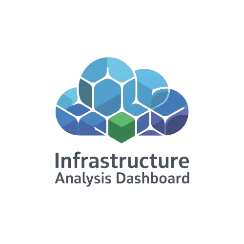

<p align="center">
  
</p>

<h1 align="center" style="font-size:2.5rem; font-weight:bold;">
  Infrastructure Analysis Dashboard
</h1>
<p align="center">
  <b>Visualize, Secure, and Understand Your Terraform Infrastructure</b>
</p>

---

## 🚀 Overview

**Infrastructure Analysis Dashboard** is a interactive web application for analyzing and visualizing Terraform state files. Instantly gain insights into your cloud infrastructure, identify security risks, map dependencies, and generate shareable reports—all in a beautiful, modern UI.

---

## 🧩 Features

- **One-Click Upload:** Drag & drop your `.tfstate` or `.json` file to get started.
- **Security Analysis:** Instantly detect public exposures, encryption gaps, and access control issues.
- **Dependency Mapping:** Visualize resource relationships and infrastructure topology.
- **Network Diagrams:** Explore interactive network graphs of your cloud resources.
- **Multi-Cloud Support:** Works with AWS, GCP, Azure, and more.
- **Exportable Reports:** Generate and share detailed analysis reports with your team.
- **Dark Mode:** Sleek, modern interface with full dark mode support.

---

## 🖥️ Screenshots


---

## ⚡ Getting Started

### 1. Clone the Repository

```bash
git clone https://github.com/your-username/terraform-state-analyzer.git
cd terraform-state-analyzer
```

### 2. Install Dependencies

```bash
npm install
```

### 3. Run the App Locally

```bash
npm run dev
```

The app will be available at [http://localhost:5173](http://localhost:5173) (or as indicated in your terminal).

---

## 🗂️ Usage

1. **Upload** your Terraform state file (`.tfstate` or `.json`).
2. **Explore** the dashboard for a summary of your infrastructure.
3. **Dive into** security, network, and dependency views.
4. **Export** your findings as a report.

---

## 🛠️ Tech Stack

- **React 18** + **TypeScript**
- **Vite** (blazing fast dev server)
- **TailwindCSS** (modern styling)
- **Recharts** & **D3** (data visualization)
- **Lucide React** (iconography)
- **React Dropzone** (file upload)

---


## 🧑‍💻 Contributing

Pull requests are welcome! For major changes, please open an issue first to discuss what you would like to change.

---

## 📄 License

[MIT](LICENSE)
